#### BONVOYAGE your travel journal app

BonVoyage is an innovative travel app designed to document and enhance your travel experiences. Whether you're planning your next adventure, or exploring local attractions, BonVoyage has everything you need to plan and document your journey seamless and enjoyable.

BonVoyage a web application built using the MERN stack (MongoDB, Express.js, React, Node.js). It allows users to plan and document memories from their travels.

## Project Done By:

1- Jassim Khamis[LinkedIn](https://www.linkedin.com/in/Jassim-Khamis)
2- Narjes Saleh [LinkedIn](https://www.linkedin.com/in/Narjes-Saleh)
3- May Alrowaie [LinkedIn](https://www.linkedin.com/in/may-alrowaie)

## User Stories

1. **Sign Up**

   - **As a new user**, I want to sign up for an account, so that I can securely save and access my travel journey’s.

   - **Acceptance Criteria**:
     - Enter a username and password.
     - Receive confirmation upon successful registration.
     - Receive an error message if the username is already taken.

2. **Sign In**

   - **As a registered user**, I want to log in and out of my account, so that I can securely access my personal travel data.
     **As a registered user, I want to update my profile information (name, bio, picture), so that it reflects my identity.
     **As a registered user, I want to reset my password, so that I can regain access if I forget my login details.

   - **Acceptance Criteria**:
     - Enter username and password.
     - Redirect to dashboard after successful login.
     - Receive an error message if credentials are incorrect.

3. **View travel journey**

   - **As a signed-in user**, I want to browse all my past journeys in one place, so that I can relive my travel memories.
   - \*\*As a user, I want to view all media from a journey in a gallery format, so that I can easily scroll through my memories.

- **As a user, I want to search for a specific journey by title, date, or location, so that I can quickly find the one I want to revisit.
  **Acceptance Criteria\*\*: - See all my past journeys in one place. - search for a specific journey.

4. **Create a travel journey**

   - **As a user**, I want to create a new journey, so that I can start recording my travel experiences.
   - \*\*As a user, I want to set the destination and dates for my journey, so that it organizes my travel timeline.
   - \*\*As a user, I want to add text content to my daily journal entry, so that I can document my travel experiences and memories.
     As a user, I want to upload photos and videos to my journal entries, so that I can visually capture my trip highlights.
     As a user, I want to add location pins to my journal entries, so that I can map out my travels.
     As a user, I want to record my mood for the day, so that I can reflect on how I felt during the journey.

   - **Acceptance Criteria**:
     - Provide details like journey’s title, dates,text content,location pins, record mood and destination.
       -upload photos and videos.
     - Redirect to travel journey page page after adding.

5. **Edit travel journey Details**

   - \*\*As a user, I want to edit my journey details like journey’s title, dates,text content,location pins, record mood and destination. so that it stays accurate if plans change.

   - **Acceptance Criteria**:
     - Change details such as journey’s title, dates,text content,location pins, record mood and destination.
     - Redirect to updated travel journey page after saving.

6. **Delete a travel journey**
   - **As a user**, I want to delete a travel journey if I no longer want to keep it.
   - **Acceptance Criteria**:
     - Remove a travel journey from the posts.
     - Redirect to travel journey’s page after deletion.

## Screenshots

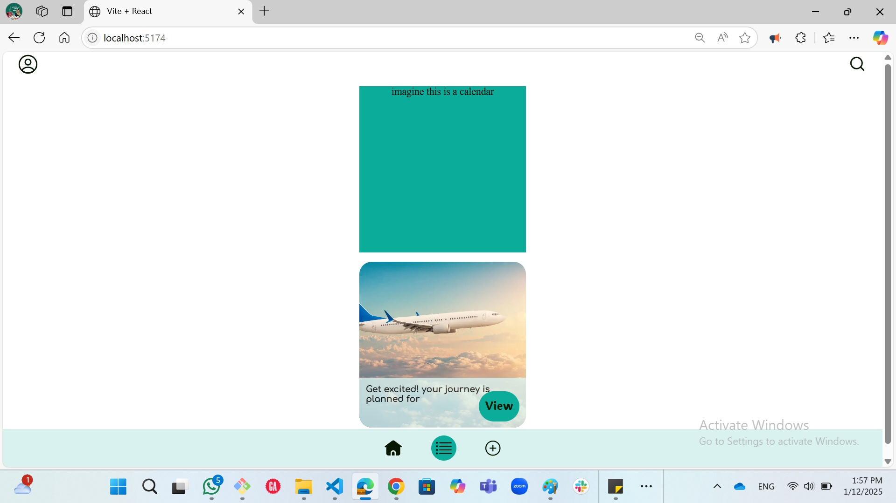
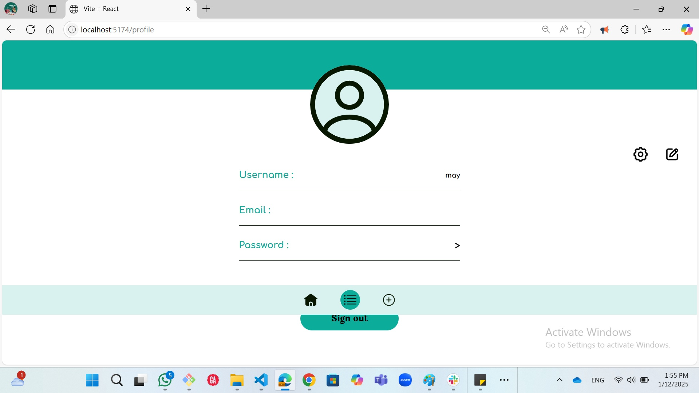
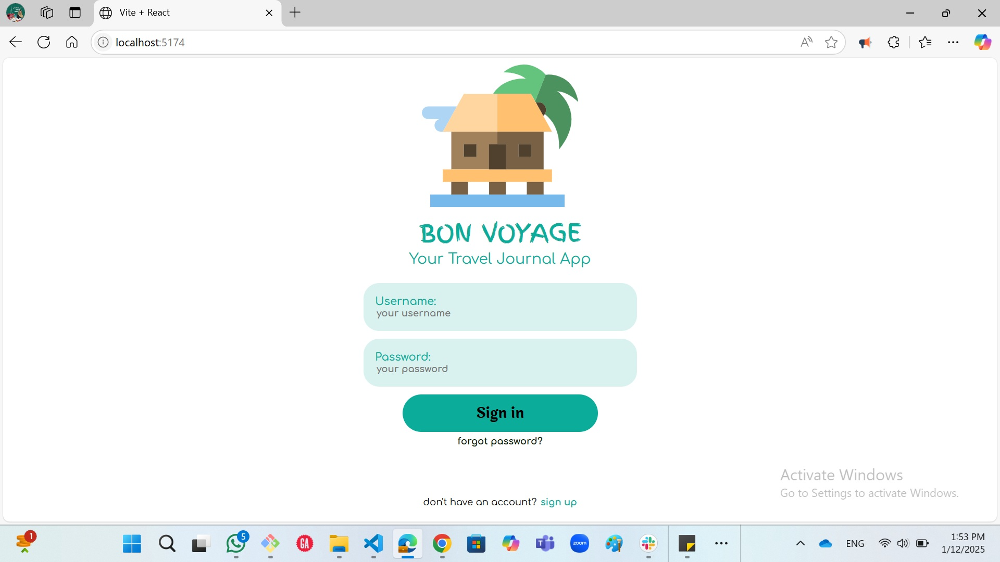
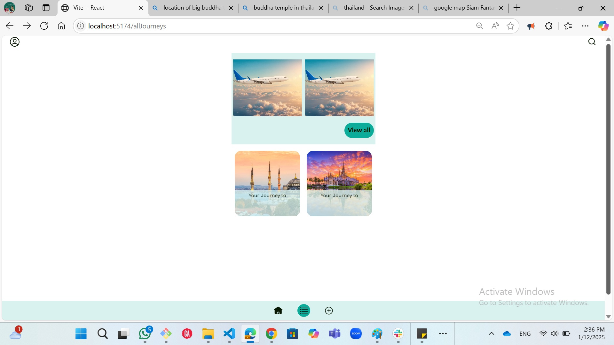
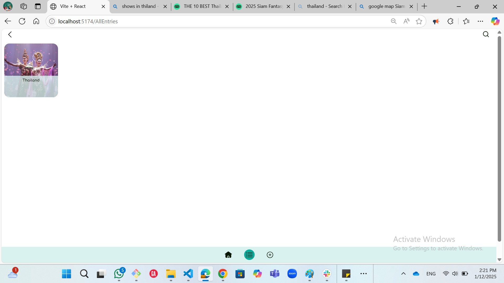
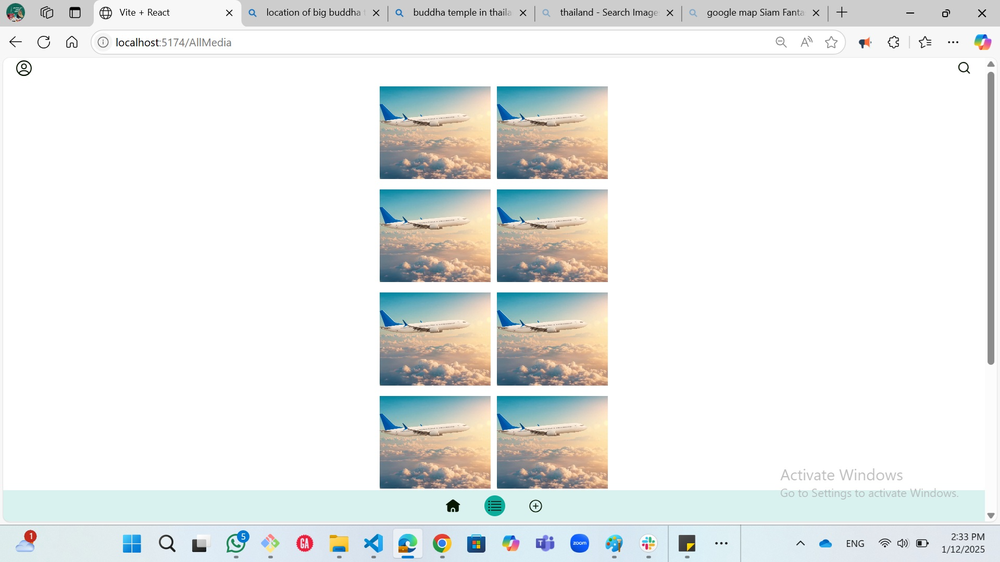
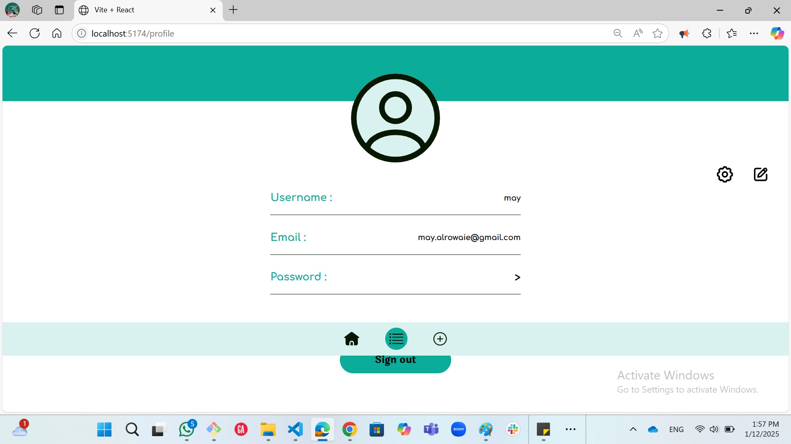
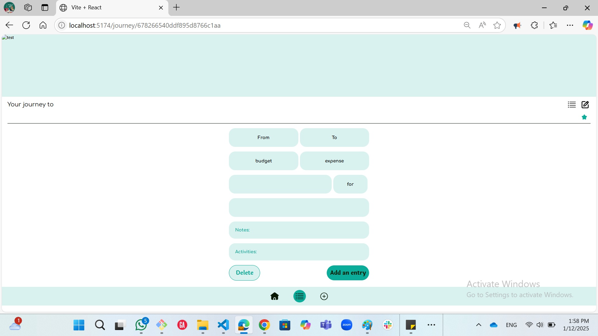
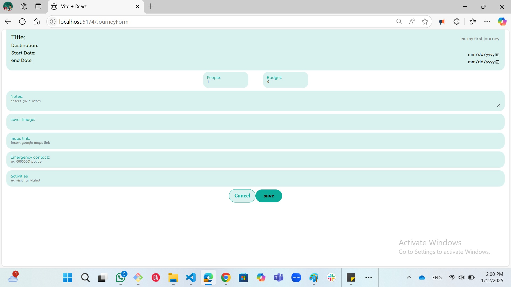
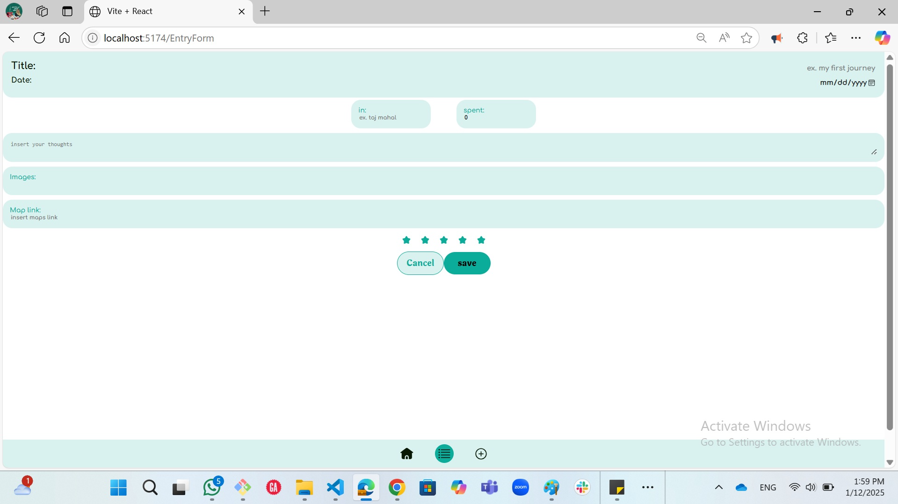
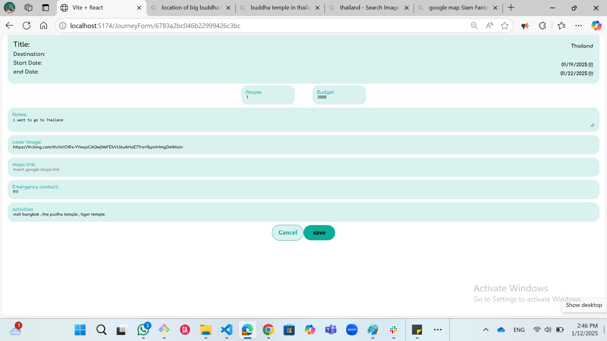
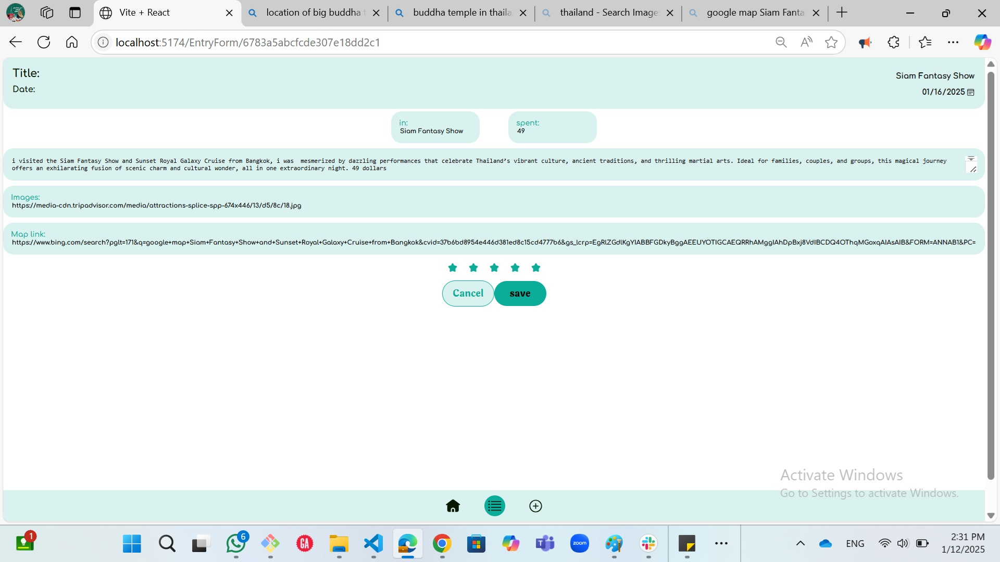

## Project Links

- [Backend](https://github.com/jkhamis8/BonVoyage-Backend)
- [Frontend](https://github.com/jkhamis8/BonVoyage)

### Initial ERD

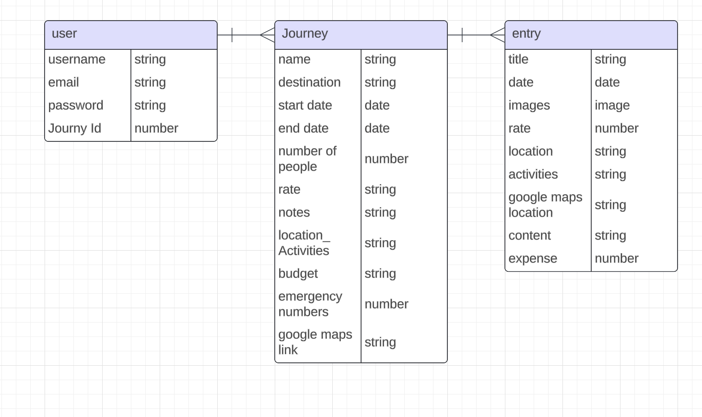

### Revised ERD:

## Technologies Used

- React.js
- JavaScript
- HTML
- CSS
- Express
- Node.js
- MongoDB
- npm
- Prettier (code formatter)

## Planned Future Enhancements

-Viewing Journeys
o View past journeys in a simple timeline or card format.

-Share a Journey
o As a user, I want to share a specific journey or entry with others via a private link or social media, so that I can show my adventures to friends and family.

-Follow Public Journeys
o As a user, I want to follow public journeys from other users, so that I can find inspiration for my next trip.

- Interactive Map
  o Display journey locations on a map.
  o Click pins to view related journal entries.
