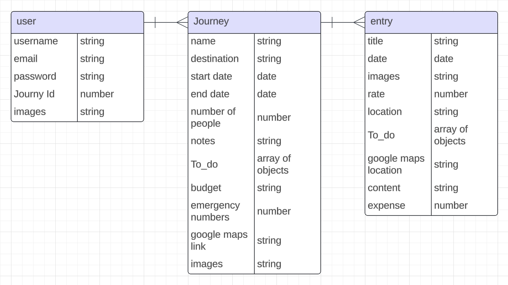

---

# BONVOYAGE your travel journal app

**Deployed Website:** [Click here!](https://)

BonVoyage is an innovative travel app designed to document and enhance your travel experiences. Whether you're planning your next adventure, or exploring local attractions, BonVoyage has everything you need to plan and document your journey seamless and enjoyable.

BonVoyage a web application built using the MERN stack (MongoDB, Express.js, React, Node.js). It allows users to plan and document memories from their travels. 
## Screenshots

## Project Links
* [Backend](https://github.com/jkhamis8/BonVoyage-Backend)
* [Frontend](/BonVoyage-FRONTEND)

## Planning Documents

### Initial ERD

### Revised ERD:

### Wireframes

## Technologies Used

- React.js
- JavaScript
- HTML
- CSS
- Express
- Node.js
- MongoDB
- npm
- Amazon Web Services
- Prettier (code formatter)
- React Select

## Planned Future Enhancements

-Viewing Journeys
o	View past journeys in a simple timeline or card format.

-Share a Journey
o	As a user, I want to share a specific journey or entry with others via a private link or social media, so that I can show my adventures to friends and family.

-Follow Public Journeys 
o	As a user, I want to follow public journeys from other users, so that I can find inspiration for my next trip.

-	Interactive Map
o	Display journey locations on a map.
o	Click pins to view related journal entries.

---
